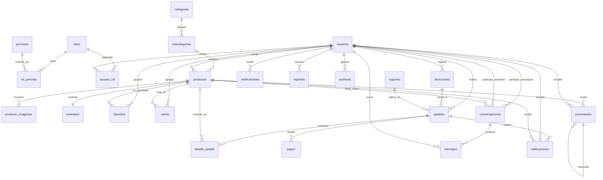

# Modelo de datos — Marketplace

> Estado: **propuesta de diseño (pendiente de aprobación)**. No contiene SQL todavía.
> Motor objetivo: **MySQL 8 / InnoDB**, codificación `utf8mb4`.

Este documento describe el modelo de datos completo para una aplicación tipo
**Facebook Marketplace / Mercado Libre**, donde un mismo usuario puede actuar como
**comprador** y como **vendedor**.

## Convenciones de diseño

- Toda tabla tiene una PK sustituta (`surrogate key`) `id BIGINT UNSIGNED AUTO_INCREMENT`,
  salvo las tablas puente (relación N:M), que usan **PK compuesta**.
- Columnas de auditoría estándar en la mayoría de tablas: `created_at`, `updated_at`
  y, donde aplica, `deleted_at` (borrado lógico / *soft delete*).
- Los importes monetarios se guardan como `DECIMAL(12,2)`.
- Los estados se modelan como `ENUM` (o tabla catálogo si crecen); aquí se documentan como ENUM.
- FK con `ON DELETE` explícito por relación (ver cada entidad).

---

## 1. Módulo: Usuarios

### `roles`
- **Propósito:** catálogo de roles del sistema (ej. `admin`, `vendedor`, `comprador`, `soporte`).
- **PK:** `id`
- **FK:** —
- **Relaciones:** N:M con `permisos` (vía `rol_permiso`); N:M con `usuarios` (vía `usuario_rol`).

### `permisos`
- **Propósito:** acciones atómicas autorizables (ej. `producto.crear`, `pedido.reembolsar`).
- **PK:** `id`
- **FK:** —
- **Relaciones:** N:M con `roles` (vía `rol_permiso`).

### `rol_permiso` (puente)
- **Propósito:** asigna permisos a roles (RBAC).
- **PK:** compuesta (`rol_id`, `permiso_id`)
- **FK:** `rol_id → roles.id`, `permiso_id → permisos.id`
- **Relaciones:** resuelve el N:M entre `roles` y `permisos`.

### `usuarios`
- **Propósito:** cuentas de la plataforma (compradores y vendedores).
- **Campos clave:** `nombre`, `apellido`, `email` (único), `password_hash`, `telefono`,
  `avatar_url`, `estado` (`activo|suspendido|eliminado`), `email_verificado_at`.
- **PK:** `id`
- **FK:** —
- **Relaciones:** N:M con `roles` (vía `usuario_rol`); 1:N con `direcciones`, `productos`
  (como vendedor), `pedidos` (como comprador), `favoritos`, `mensajes`, `notificaciones`,
  `calificaciones`, `comentarios`, `reportes`.

### `usuario_rol` (puente)
- **Propósito:** un usuario puede tener varios roles a la vez.
- **PK:** compuesta (`usuario_id`, `rol_id`)
- **FK:** `usuario_id → usuarios.id`, `rol_id → roles.id`

### `direcciones`
- **Propósito:** direcciones de envío/facturación de cada usuario.
- **Campos clave:** `alias`, `calle`, `numero`, `ciudad`, `estado_region`, `pais`,
  `codigo_postal`, `es_principal`.
- **PK:** `id`
- **FK:** `usuario_id → usuarios.id`
- **Relaciones:** 1:N desde `usuarios`; referenciada por `pedidos` (dirección de envío).

---

## 2. Módulo: Productos

### `categorias`
- **Propósito:** clasificación de primer nivel (ej. Electrónica, Hogar).
- **Campos clave:** `nombre`, `slug` (único), `descripcion`, `activo`.
- **PK:** `id`
- **FK:** —
- **Relaciones:** 1:N con `subcategorias`.

### `subcategorias`
- **Propósito:** clasificación de segundo nivel dentro de una categoría.
- **Campos clave:** `nombre`, `slug`, `activo`.
- **PK:** `id`
- **FK:** `categoria_id → categorias.id`
- **Relaciones:** 1:N con `productos`.

### `productos`
- **Propósito:** publicaciones que un vendedor pone a la venta.
- **Campos clave:** `titulo`, `slug`, `descripcion`, `precio`, `condicion` (`nuevo|usado`),
  `estado` (`borrador|activo|pausado|vendido|eliminado`), `sku`.
- **PK:** `id`
- **FK:** `vendedor_id → usuarios.id`, `subcategoria_id → subcategorias.id`
- **Relaciones:** 1:N con `producto_imagenes`, `favoritos`, `comentarios`,
  `detalle_pedido`, `carrito`; 1:1 con `inventario`.

### `producto_imagenes`
- **Propósito:** galería de imágenes de un producto.
- **Campos clave:** `url`, `orden`, `es_principal`.
- **PK:** `id`
- **FK:** `producto_id → productos.id` (ON DELETE CASCADE)
- **Relaciones:** N:1 hacia `productos`.

### `inventario`
- **Propósito:** control de existencias de un producto (separado para escalar a variantes/almacenes).
- **Campos clave:** `stock`, `stock_reservado`, `umbral_bajo`.
- **PK:** `id`
- **FK:** `producto_id → productos.id` (único → 1:1)
- **Relaciones:** 1:1 con `productos`.

### `favoritos`
- **Propósito:** productos guardados/marcados por un usuario ("me gusta").
- **PK:** `id` (con índice único (`usuario_id`, `producto_id`) para evitar duplicados)
- **FK:** `usuario_id → usuarios.id`, `producto_id → productos.id`
- **Relaciones:** resuelve N:M entre `usuarios` y `productos`.

---

## 3. Módulo: Ventas

### `carrito`
- **Propósito:** líneas del carrito de compra activo de cada usuario (una fila por producto).
- **Campos clave:** `cantidad`, `precio_unitario` (foto del precio al agregar).
- **PK:** `id` (índice único (`usuario_id`, `producto_id`))
- **FK:** `usuario_id → usuarios.id`, `producto_id → productos.id`
- **Relaciones:** N:1 con `usuarios` y `productos`.

### `pedidos`
- **Propósito:** orden de compra confirmada (cabecera).
- **Campos clave:** `codigo` (único, legible), `estado`
  (`pendiente|pagado|enviado|entregado|cancelado|reembolsado`), `subtotal`,
  `descuento`, `envio`, `total`.
- **PK:** `id`
- **FK:** `comprador_id → usuarios.id`, `direccion_id → direcciones.id`,
  `cupon_id → cupones.id` (nullable)
- **Relaciones:** 1:N con `detalle_pedido`; 1:1/1:N con `pagos`; origen de `calificaciones`.

### `detalle_pedido`
- **Propósito:** líneas del pedido (productos comprados con su precio histórico).
- **Campos clave:** `cantidad`, `precio_unitario`, `subtotal`.
- **PK:** `id`
- **FK:** `pedido_id → pedidos.id` (ON DELETE CASCADE), `producto_id → productos.id`,
  `vendedor_id → usuarios.id` (desnormalizado para reportes por vendedor)
- **Relaciones:** N:1 con `pedidos` y `productos`.

### `pagos`
- **Propósito:** intentos y confirmaciones de pago de un pedido.
- **Campos clave:** `metodo` (`tarjeta|paypal|transferencia|contra_entrega`),
  `estado` (`iniciado|aprobado|rechazado|reembolsado`), `monto`,
  `referencia_externa` (id de la pasarela).
- **PK:** `id`
- **FK:** `pedido_id → pedidos.id`
- **Relaciones:** N:1 con `pedidos`.

---

## 4. Módulo: Comunicación

### `conversaciones`
- **Propósito:** hilo de chat entre un comprador y un vendedor, normalmente sobre un producto.
- **Campos clave:** `ultimo_mensaje_at`.
- **PK:** `id`
- **FK:** `comprador_id → usuarios.id`, `vendedor_id → usuarios.id`,
  `producto_id → productos.id` (nullable)
- **Relaciones:** 1:N con `mensajes`.

### `mensajes`
- **Propósito:** mensajes individuales dentro de una conversación.
- **Campos clave:** `contenido`, `leido_at`.
- **PK:** `id`
- **FK:** `conversacion_id → conversaciones.id` (ON DELETE CASCADE),
  `emisor_id → usuarios.id`
- **Relaciones:** N:1 con `conversaciones`.

### `notificaciones`
- **Propósito:** avisos al usuario (nuevo mensaje, cambio de estado de pedido, etc.).
- **Campos clave:** `tipo`, `titulo`, `contenido`, `data` (JSON), `leido_at`.
- **PK:** `id`
- **FK:** `usuario_id → usuarios.id`
- **Relaciones:** N:1 con `usuarios`.

---

## 5. Módulo: Comunidad

### `calificaciones`
- **Propósito:** reseñas con puntuación (1–5) tras una compra (compra verificada).
- **Campos clave:** `puntuacion` (1–5), `comentario`.
- **PK:** `id`
- **FK:** `pedido_id → pedidos.id`, `autor_id → usuarios.id` (comprador),
  `vendedor_id → usuarios.id`, `producto_id → productos.id`
- **Relaciones:** N:1 con `pedidos`, `usuarios`, `productos`.

### `comentarios`
- **Propósito:** preguntas/comentarios públicos en la ficha de un producto (con respuestas anidadas).
- **Campos clave:** `contenido`, `parent_id` (auto-referencia para respuestas).
- **PK:** `id`
- **FK:** `producto_id → productos.id`, `usuario_id → usuarios.id`,
  `parent_id → comentarios.id` (nullable, auto-referencia)
- **Relaciones:** N:1 con `productos` y `usuarios`; jerarquía interna.

### `reportes`
- **Propósito:** denuncias de contenido (producto, usuario, comentario, mensaje).
- **Campos clave:** `entidad_tipo` (`producto|usuario|comentario|mensaje`),
  `entidad_id`, `motivo`, `estado` (`abierto|en_revision|resuelto|descartado`).
- **PK:** `id`
- **FK:** `reportante_id → usuarios.id`, `revisado_por → usuarios.id` (nullable)
- **Relaciones:** relación polimórfica (por `entidad_tipo` + `entidad_id`), sin FK directa
  a la entidad reportada.

---

## 6. Módulo: Administración

### `auditoria`
- **Propósito:** rastro de cambios sobre registros sensibles (quién cambió qué y cuándo).
- **Campos clave:** `accion` (`crear|actualizar|eliminar`), `tabla`, `registro_id`,
  `datos_antes` (JSON), `datos_despues` (JSON), `ip`.
- **PK:** `id`
- **FK:** `usuario_id → usuarios.id` (nullable; puede ser proceso del sistema)
- **Relaciones:** N:1 con `usuarios`.

### `logs`
- **Propósito:** eventos técnicos de la aplicación (errores, jobs, integraciones).
- **Campos clave:** `nivel` (`debug|info|warning|error|critical`), `canal`, `mensaje`,
  `contexto` (JSON).
- **PK:** `id`
- **FK:** — (independiente de usuarios)
- **Relaciones:** —

### `configuraciones`
- **Propósito:** parámetros globales de la plataforma (clave/valor).
- **Campos clave:** `clave` (única), `valor`, `tipo` (`string|int|bool|json`), `descripcion`.
- **PK:** `id`
- **FK:** —
- **Relaciones:** —

### `banners`
- **Propósito:** piezas promocionales del home/campañas.
- **Campos clave:** `titulo`, `imagen_url`, `enlace`, `posicion`, `activo`,
  `inicia_at`, `termina_at`.
- **PK:** `id`
- **FK:** —
- **Relaciones:** —

### `cupones`
- **Propósito:** códigos de descuento aplicables a un pedido.
- **Campos clave:** `codigo` (único), `tipo` (`porcentaje|monto_fijo`), `valor`,
  `usos_maximos`, `usos_actuales`, `minimo_compra`, `inicia_at`, `expira_at`, `activo`.
- **PK:** `id`
- **FK:** —
- **Relaciones:** referenciado por `pedidos.cupon_id`.

---

## 7. Diagrama Entidad-Relación (Mermaid)

> Nota: `reportes` es polimórfico (`entidad_tipo` + `entidad_id`), por lo que no se dibuja
> con FK directas hacia producto/comentario/mensaje. `logs`, `configuraciones` y `banners`
> son tablas independientes (sin relaciones) y por eso no aparecen en el diagrama.

---

## 8. Resumen de tablas (27)

| Módulo | Tablas |
|---|---|
| Usuarios | `roles`, `permisos`, `rol_permiso`, `usuarios`, `usuario_rol`, `direcciones` |
| Productos | `categorias`, `subcategorias`, `productos`, `producto_imagenes`, `inventario`, `favoritos` |
| Ventas | `carrito`, `pedidos`, `detalle_pedido`, `pagos` |
| Comunicación | `conversaciones`, `mensajes`, `notificaciones` |
| Comunidad | `calificaciones`, `comentarios`, `reportes` |
| Administración | `auditoria`, `logs`, `configuraciones`, `banners`, `cupones` |

## 9. Decisiones a validar antes de escribir SQL

1. **RBAC con tablas puente** (`usuario_rol`, `rol_permiso`) vs. un solo `rol_id` en `usuarios`.
   Propongo puente (más flexible).
2. **Carrito** como líneas directas (`usuario_id` + `producto_id`) vs. cabecera `carrito` + `carrito_items`.
   Propongo líneas directas (más simple).
3. **`reportes` polimórfico** vs. tablas separadas por tipo de entidad. Propongo polimórfico.
4. **Borrado lógico** (`deleted_at`) en `usuarios`, `productos`, `pedidos`. Propongo activarlo.
5. Motor **MySQL/InnoDB** confirmado.
