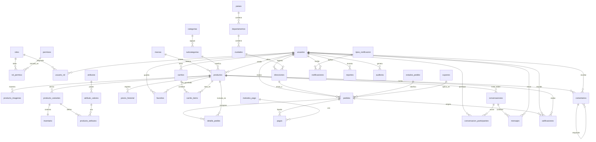

# Modelo de datos — Marketplace

> Estado: **propuesta de diseño v2 (pendiente de aprobación final)**. No contiene SQL todavía.
> Motor objetivo: **MySQL 8 / InnoDB**, codificación `utf8mb4`.

Este documento describe el modelo de datos completo para una aplicación tipo
**Facebook Marketplace / Mercado Libre**, donde un mismo usuario puede actuar como
**comprador** y como **vendedor**.

> **Cambios v2 (aprobados):** `carrito` → `carritos` + `carrito_items`; catálogo de
> productos ampliado (`marcas`, `producto_variantes`, `atributos`, `atributo_valores`,
> `producto_atributos`); `precio_historial`; estados y métodos de pago normalizados a
> tablas (`estados_pedido`, `metodos_pago`); ubicaciones normalizadas
> (`paises`, `departamentos`, `ciudades`); `conversacion_participantes`; `tipos_notificacion`.

## Convenciones de diseño

- Toda tabla tiene una PK sustituta (`surrogate key`) `id BIGINT UNSIGNED AUTO_INCREMENT`,
  salvo las tablas puente (relación N:M), que usan **PK compuesta**.
- Columnas de auditoría estándar en la mayoría de tablas: `created_at`, `updated_at`.
- **Soft delete** (`deleted_at`) **solo en**: `usuarios`, `productos`, `categorias`,
  `direcciones`. El resto usa borrado físico. Catálogos usan `activo`.
- **Modelo centrado en variante:** todo producto tiene **al menos una variante**
  (los productos simples usan una variante por defecto). Por eso el **precio de
  venta** y el **stock/inventario** se manejan **por variante**, y `variante_id`
  nunca es NULL en `carrito_items`, `detalle_pedido`, `inventario` y `precio_historial`.
- Los importes monetarios se guardan como `DECIMAL(12,2)`.
- Los **estados y catálogos** se modelan como **tablas** (no ENUM), para permitir
  altas/bajas sin migraciones.
- FK con `ON DELETE` explícito por relación (ver cada entidad).

---

## 1. Módulo: Usuarios

### `roles`
- **Propósito:** catálogo de roles del sistema (ej. `admin`, `vendedor`, `comprador`, `soporte`).
- **PK:** `id` · **FK:** —
- **Relaciones:** N:M con `permisos` (vía `rol_permiso`); N:M con `usuarios` (vía `usuario_rol`).

### `permisos`
- **Propósito:** acciones atómicas autorizables (ej. `producto.crear`, `pedido.reembolsar`).
- **PK:** `id` · **FK:** —
- **Relaciones:** N:M con `roles` (vía `rol_permiso`).

### `rol_permiso` (puente)
- **Propósito:** asigna permisos a roles (RBAC).
- **PK:** compuesta (`rol_id`, `permiso_id`)
- **FK:** `rol_id → roles.id`, `permiso_id → permisos.id`

### `usuarios`
- **Propósito:** cuentas de la plataforma (compradores y vendedores).
- **Campos clave:** `nombre`, `apellido`, `email` (único), `password_hash`, `telefono`,
  `avatar_url`, `estado` (`activo|suspendido|eliminado`), `email_verificado_at`, `deleted_at`.
- **PK:** `id` · **FK:** —
- **Relaciones:** N:M con `roles` (vía `usuario_rol`); 1:N con `direcciones`, `productos`
  (como vendedor), `pedidos`, `favoritos`, `mensajes`, `notificaciones`, `calificaciones`,
  `comentarios`, `reportes`; N:M con `conversaciones` (vía `conversacion_participantes`).

### `usuario_rol` (puente)
- **Propósito:** un usuario puede tener varios roles a la vez.
- **PK:** compuesta (`usuario_id`, `rol_id`)
- **FK:** `usuario_id → usuarios.id`, `rol_id → roles.id`

### `direcciones`
- **Propósito:** direcciones de envío/facturación de cada usuario (**ubicación normalizada**).
- **Campos clave:** `alias`, `calle`, `numero`, `referencia`, `codigo_postal`, `es_principal`.
- **PK:** `id`
- **FK:** `usuario_id → usuarios.id`, `ciudad_id → ciudades.id`
- **Relaciones:** 1:N desde `usuarios`; referenciada por `pedidos` (dirección de envío).

---

## 2. Módulo: Ubicaciones (normalizadas)

### `paises`
- **Propósito:** catálogo de países.
- **Campos clave:** `nombre`, `iso2` (único), `iso3`, `activo`.
- **PK:** `id` · **FK:** — · **Relaciones:** 1:N con `departamentos`.

### `departamentos`
- **Propósito:** división administrativa de primer nivel (departamento/estado/provincia).
- **Campos clave:** `nombre`, `activo`.
- **PK:** `id` · **FK:** `pais_id → paises.id` · **Relaciones:** 1:N con `ciudades`.

### `ciudades`
- **Propósito:** ciudades/municipios.
- **Campos clave:** `nombre`, `activo`.
- **PK:** `id` · **FK:** `departamento_id → departamentos.id`
- **Relaciones:** referenciada por `direcciones`.

---

## 3. Módulo: Productos

### `marcas`
- **Propósito:** marcas/fabricantes de los productos (ej. Samsung, Nike).
- **Campos clave:** `nombre`, `slug` (único), `logo_url`, `activo`.
- **PK:** `id` · **FK:** — · **Relaciones:** 1:N con `productos`.

### `categorias`
- **Propósito:** clasificación de primer nivel (ej. Electrónica, Hogar).
- **Campos clave:** `nombre`, `slug` (único), `descripcion`, `activo`.
- **PK:** `id` · **FK:** — · **Relaciones:** 1:N con `subcategorias`.

### `subcategorias`
- **Propósito:** clasificación de segundo nivel dentro de una categoría.
- **Campos clave:** `nombre`, `slug`, `activo`.
- **PK:** `id` · **FK:** `categoria_id → categorias.id` · **Relaciones:** 1:N con `productos`.

### `productos`
- **Propósito:** publicaciones que un vendedor pone a la venta.
- **Campos clave:** `titulo`, `slug`, `descripcion`, `precio` (**referencia**; el de
  venta vive en la variante), `condicion` (`nuevo|usado`),
  `estado` (`borrador|activo|pausado|vendido|eliminado`), `sku`, `deleted_at`.
- **PK:** `id`
- **FK:** `vendedor_id → usuarios.id`, `subcategoria_id → subcategorias.id`,
  `marca_id → marcas.id` (nullable)
- **Relaciones:** 1:N con `producto_imagenes`, `producto_variantes`, `favoritos`,
  `comentarios`, `detalle_pedido`, `carrito_items`, `precio_historial`, `producto_atributos`.

### `producto_variantes`
- **Propósito:** combinaciones vendibles de un producto (ej. Camiseta *Roja / Talla M*),
  cada una con su propio SKU y **precio autoritativo**. Todo producto tiene ≥1 variante.
- **Campos clave:** `sku` (único), `precio`, `activo`.
- **PK:** `id` · **FK:** `producto_id → productos.id` (ON DELETE CASCADE)
- **Relaciones:** N:M con `atributo_valores` (vía `producto_atributos`); 1:1 con `inventario`.

### `atributos`
- **Propósito:** definición de atributos configurables (ej. Color, Talla, Material).
- **Campos clave:** `nombre`, `tipo` (`texto|numero|color|booleano`), `activo`.
- **PK:** `id` · **FK:** — · **Relaciones:** 1:N con `atributo_valores`.

### `atributo_valores`
- **Propósito:** valores posibles de un atributo (ej. Rojo, Azul; S, M, L).
- **Campos clave:** `valor`.
- **PK:** `id` · **FK:** `atributo_id → atributos.id`
- **Relaciones:** N:M con `producto_variantes` (vía `producto_atributos`).

### `producto_atributos` (puente)
- **Propósito:** define qué valores de atributo caracterizan a cada variante.
- **PK:** compuesta (`variante_id`, `atributo_valor_id`)
- **FK:** `variante_id → producto_variantes.id` (ON DELETE CASCADE),
  `atributo_valor_id → atributo_valores.id`

### `producto_imagenes`
- **Propósito:** galería de imágenes de un producto (o variante).
- **Campos clave:** `url`, `orden`, `es_principal`.
- **PK:** `id`
- **FK:** `producto_id → productos.id` (ON DELETE CASCADE),
  `variante_id → producto_variantes.id` (nullable; imagen a nivel producto o variante)

### `inventario`
- **Propósito:** control de existencias **por variante** (1:1). Fuente de verdad del stock.
- **Campos clave:** `stock`, `stock_reservado`, `umbral_bajo`.
- **PK:** `id` · **FK:** `variante_id → producto_variantes.id` (único → 1:1)

### `precio_historial`
- **Propósito:** trazabilidad de cambios de precio **por variante**.
- **Campos clave:** `precio_anterior`, `precio_nuevo`, `motivo`, `vigente_desde`.
- **PK:** `id`
- **FK:** `variante_id → producto_variantes.id` (NOT NULL),
  `producto_id → productos.id` (para agrupar), `usuario_id → usuarios.id` (quién cambió; nullable)

### `favoritos`
- **Propósito:** productos guardados/marcados por un usuario.
- **PK:** `id` (índice único (`usuario_id`, `producto_id`))
- **FK:** `usuario_id → usuarios.id`, `producto_id → productos.id`

---

## 4. Módulo: Ventas

### `carritos`
- **Propósito:** cabecera del carrito de un usuario (uno activo por usuario).
- **Campos clave:** `estado` (`activo|convertido|abandonado`).
- **PK:** `id` · **FK:** `usuario_id → usuarios.id`
- **Relaciones:** 1:N con `carrito_items`.

### `carrito_items`
- **Propósito:** líneas del carrito (producto/variante + cantidad).
- **Campos clave:** `cantidad`, `precio_unitario` (foto del precio al agregar).
- **PK:** `id` (índice único (`carrito_id`, `variante_id`))
- **FK:** `carrito_id → carritos.id` (ON DELETE CASCADE), `producto_id → productos.id`,
  `variante_id → producto_variantes.id` (**NOT NULL**)

### `estados_pedido`
- **Propósito:** catálogo de estados de pedido (reemplaza el ENUM).
- **Campos clave:** `clave` (única, ej. `pendiente`), `nombre`, `orden`, `es_final`, `activo`.
- **PK:** `id` · **FK:** — · **Relaciones:** 1:N con `pedidos`.

### `pedidos`
- **Propósito:** orden de compra confirmada (cabecera).
- **Campos clave:** `codigo` (único), `subtotal`, `descuento`, `envio`, `total`.
- **PK:** `id`
- **FK:** `comprador_id → usuarios.id`, `direccion_id → direcciones.id`,
  `estado_id → estados_pedido.id`, `cupon_id → cupones.id` (nullable)
- **Relaciones:** 1:N con `detalle_pedido`; 1:N con `pagos`; origen de `calificaciones`.

### `detalle_pedido`
- **Propósito:** líneas del pedido (productos comprados con su precio histórico).
- **Campos clave:** `cantidad`, `precio_unitario`, `subtotal`.
- **PK:** `id`
- **FK:** `pedido_id → pedidos.id` (ON DELETE CASCADE), `producto_id → productos.id`,
  `variante_id → producto_variantes.id` (**NOT NULL**, ON DELETE RESTRICT), `vendedor_id → usuarios.id`
  (desnormalizado para reportes por vendedor)

### `metodos_pago`
- **Propósito:** catálogo de métodos de pago (reemplaza el ENUM).
- **Campos clave:** `clave` (única, ej. `tarjeta`), `nombre`, `activo`.
- **PK:** `id` · **FK:** — · **Relaciones:** 1:N con `pagos`.

### `pagos`
- **Propósito:** intentos y confirmaciones de pago de un pedido.
- **Campos clave:** `estado` (`iniciado|aprobado|rechazado|reembolsado`), `monto`,
  `referencia_externa` (id de la pasarela).
- **PK:** `id`
- **FK:** `pedido_id → pedidos.id`, `metodo_pago_id → metodos_pago.id`

---

## 5. Módulo: Comunicación

### `conversaciones`
- **Propósito:** hilo de chat, normalmente sobre un producto. Los participantes se
  gestionan por tabla puente (permite 1:1 y, a futuro, grupos/soporte).
- **Campos clave:** `ultimo_mensaje_at`.
- **PK:** `id` · **FK:** `producto_id → productos.id` (nullable)
- **Relaciones:** N:M con `usuarios` (vía `conversacion_participantes`); 1:N con `mensajes`.

### `conversacion_participantes` (puente)
- **Propósito:** usuarios que participan en una conversación y su estado de lectura.
- **Campos clave:** `rol_en_conversacion` (`comprador|vendedor|soporte`),
  `ultimo_leido_at`, `silenciado`.
- **PK:** compuesta (`conversacion_id`, `usuario_id`)
- **FK:** `conversacion_id → conversaciones.id` (ON DELETE CASCADE),
  `usuario_id → usuarios.id`

### `mensajes`
- **Propósito:** mensajes individuales dentro de una conversación.
- **Campos clave:** `contenido`, `leido_at`.
- **PK:** `id`
- **FK:** `conversacion_id → conversaciones.id` (ON DELETE CASCADE),
  `emisor_id → usuarios.id`

### `tipos_notificacion`
- **Propósito:** catálogo de tipos de notificación con su plantilla.
- **Campos clave:** `clave` (única, ej. `nuevo_mensaje`), `nombre`, `plantilla`,
  `icono`, `activo`.
- **PK:** `id` · **FK:** — · **Relaciones:** 1:N con `notificaciones`.

### `notificaciones`
- **Propósito:** avisos al usuario (nuevo mensaje, cambio de estado de pedido, etc.).
- **Campos clave:** `titulo`, `contenido`, `data` (JSON), `leido_at`.
- **PK:** `id`
- **FK:** `usuario_id → usuarios.id`, `tipo_notificacion_id → tipos_notificacion.id`

---

## 6. Módulo: Comunidad

### `calificaciones`
- **Propósito:** reseñas con puntuación (1–5) tras una compra (compra verificada).
- **Campos clave:** `puntuacion` (1–5), `comentario`.
- **PK:** `id`
- **FK:** `pedido_id → pedidos.id`, `autor_id → usuarios.id`,
  `vendedor_id → usuarios.id`, `producto_id → productos.id`

### `comentarios`
- **Propósito:** preguntas/comentarios públicos en la ficha de un producto (con respuestas anidadas).
- **Campos clave:** `contenido`, `parent_id` (auto-referencia).
- **PK:** `id`
- **FK:** `producto_id → productos.id`, `usuario_id → usuarios.id`,
  `parent_id → comentarios.id` (nullable, auto-referencia)

### `reportes`
- **Propósito:** denuncias de contenido (**polimórfico**).
- **Campos clave:** `entidad_tipo` (`producto|usuario|comentario|mensaje`),
  `entidad_id`, `motivo`, `estado` (`abierto|en_revision|resuelto|descartado`).
- **PK:** `id`
- **FK:** `reportante_id → usuarios.id`, `revisado_por → usuarios.id` (nullable)
- **Relaciones:** relación polimórfica (`entidad_tipo` + `entidad_id`), sin FK directa
  a la entidad reportada.

---

## 7. Módulo: Administración

### `auditoria`
- **Propósito:** rastro de cambios sobre registros sensibles.
- **Campos clave:** `accion` (`crear|actualizar|eliminar`), `tabla`, `registro_id`,
  `datos_antes` (JSON), `datos_despues` (JSON), `ip`.
- **PK:** `id` · **FK:** `usuario_id → usuarios.id` (nullable)

### `logs`
- **Propósito:** eventos técnicos de la aplicación.
- **Campos clave:** `nivel` (`debug|info|warning|error|critical`), `canal`, `mensaje`,
  `contexto` (JSON).
- **PK:** `id` · **FK:** —

### `configuraciones`
- **Propósito:** parámetros globales (clave/valor).
- **Campos clave:** `clave` (única), `valor`, `tipo` (`string|int|bool|json`), `descripcion`.
- **PK:** `id` · **FK:** —

### `banners`
- **Propósito:** piezas promocionales del home/campañas.
- **Campos clave:** `titulo`, `imagen_url`, `enlace`, `posicion`, `activo`,
  `inicia_at`, `termina_at`.
- **PK:** `id` · **FK:** —

### `cupones`
- **Propósito:** códigos de descuento aplicables a un pedido.
- **Campos clave:** `codigo` (único), `tipo` (`porcentaje|monto_fijo`), `valor`,
  `usos_maximos`, `usos_actuales`, `minimo_compra`, `inicia_at`, `expira_at`, `activo`.
- **PK:** `id` · **FK:** — · **Relaciones:** referenciado por `pedidos.cupon_id`.

---

## 8. Diagrama Entidad-Relación (Mermaid)

> Nota: `reportes` es polimórfico (`entidad_tipo` + `entidad_id`), sin FK directas.
> `logs`, `configuraciones` y `banners` son independientes (sin relaciones).

---

## 9. Resumen de tablas (41)

| Módulo | Tablas |
|---|---|
| Usuarios | `roles`, `permisos`, `rol_permiso`, `usuarios`, `usuario_rol`, `direcciones` |
| Ubicaciones | `paises`, `departamentos`, `ciudades` |
| Productos | `marcas`, `categorias`, `subcategorias`, `productos`, `producto_variantes`, `atributos`, `atributo_valores`, `producto_atributos`, `producto_imagenes`, `inventario`, `precio_historial`, `favoritos` |
| Ventas | `carritos`, `carrito_items`, `estados_pedido`, `pedidos`, `detalle_pedido`, `metodos_pago`, `pagos` |
| Comunicación | `conversaciones`, `conversacion_participantes`, `mensajes`, `tipos_notificacion`, `notificaciones` |
| Comunidad | `calificaciones`, `comentarios`, `reportes` |
| Administración | `auditoria`, `logs`, `configuraciones`, `banners`, `cupones` |

---

## 10. Decisiones finales (resueltas)

1. **Stock y precio por variante.** Todo producto tiene ≥1 variante (los simples usan
   una por defecto). El **stock** vive en `inventario` (1:1 con la variante) y el
   **precio de venta** en `producto_variantes.precio`. `productos.precio` es solo
   referencia. `variante_id` es NOT NULL en `carrito_items`, `detalle_pedido`,
   `inventario` y `precio_historial`.
2. **`carrito_items`** usa `UNIQUE (carrito_id, variante_id)`.
3. **Imágenes de variante.** `producto_imagenes.variante_id` es nullable (imagen a nivel
   producto o variante).
4. **Soft delete** solo en: `usuarios`, `productos`, `categorias`, `direcciones`.
5. **`pedido_estado_historial`** queda **fuera** de este alcance (no solicitado).

> Validado contra **MySQL 8.4** (Docker): 41 tablas, 55 FKs, 4 vistas, 4 rutinas,
> 4 triggers; CHECK y `ON DELETE` verificados con pruebas positivas y negativas.
